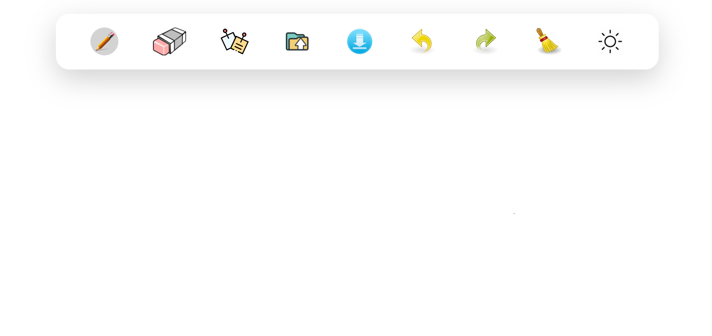
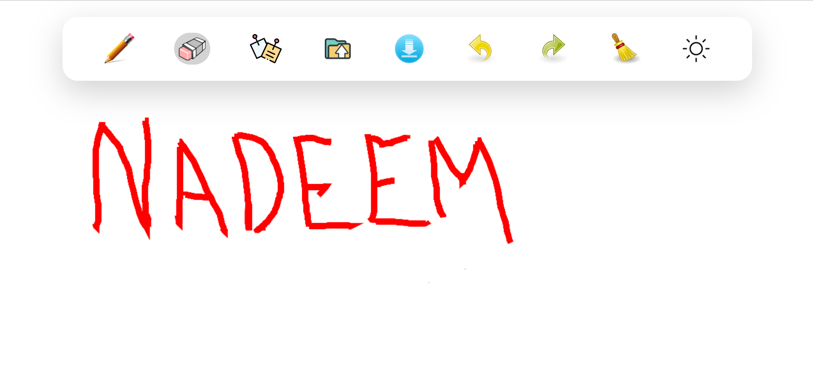

#openBoard

##  Welcome to Openboard! 

#### This application is build as I was curious to know the working behind ZoomBoard and Microsoft Whiteboard.

#### I usually use the openboard for dry run coding question using my Pen tablet. 

#### Employed canvas API to implement 5 features of openboard namely :

#### 1. Draw
#### 2. Erase
#### 3. Save
#### 4. Undo
#### 5. Redo

## AppPreview 

### Initial Preview (Before Drawing)

  

### After Drawing

  

